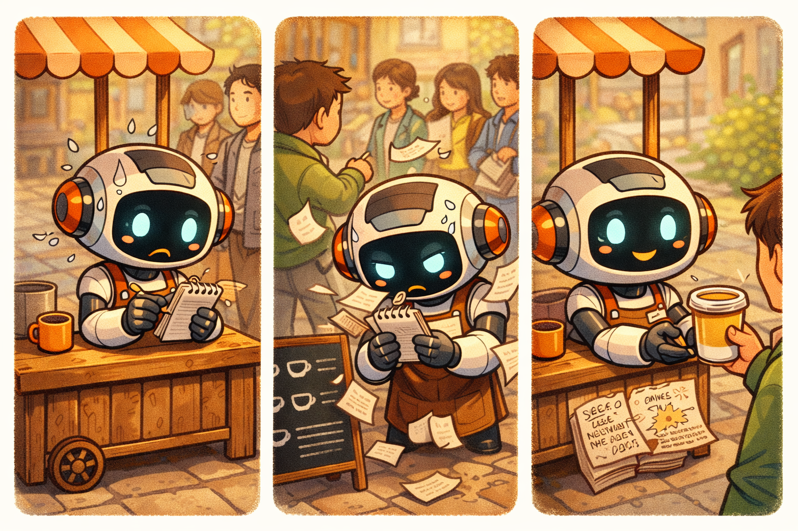

# ☕ Level 01: Local Barista

## What are we building?

An AI barista called Brew that runs on your laptop. You talk to it, it checks the menu, recommends drinks, and takes your order.

## Key concepts

- **Strands Agent:** An open-source SDK from AWS for building AI agents. An "agent" is an AI that can use tools (functions) to do things, not just chat.
- **BedrockModel:** Connects the agent to a foundation model (like Claude) hosted on Amazon Bedrock.
- **Tools (`@tool`):** Python functions the agent can call. Brew has `get_menu` and `place_order`.
- **System Prompt:** Instructions that define Brew's personality and rules.

## Prerequisites

- Python 3.11+
- AWS credentials configured
- `python3.11 -m pip install strands-agents strands-agents-tools boto3`

Set your AWS profile:
```bash
export AWS_PROFILE=<your-profile>
```

## Step 1: Copy files and run

```bash
cp -f level_01_local_barista/agent.py agent.py
cp -f level_01_local_barista/agent_tools.py agent_tools.py
python3.11 agent.py
```

The script sends 4 demo prompts to Brew (in Spanish and English) and prints the responses.

## Files

| File | What it does |
|---|---|
| `agent.py` | The agent — grows with each level. Currently: local mode with basic tools |
| `agent_tools.py` | Menu data + two tools: `get_menu` and `place_order` |

## Summary — The Adventures of Brew

<p align="center">
  
  <br><em>From scribbling orders on paper to serving the perfect cup — Brew's first day. But can he handle the growing line?</em>
</p>

## What's next

Level 02 deploys this same Brew to the cloud using AgentCore Runtime.

➡️ [Go to Level 02](../level_02_cloud_barista/INSTRUCTIONS.md)

## Troubleshooting

| Error | Fix |
|---|---|
| `ModuleNotFoundError: strands` | Run `python3.11 -m pip install strands-agents strands-agents-tools boto3` |
| `AccessDeniedException` on Bedrock | Check your AWS credentials and that the model is enabled in Bedrock console |
| `No module named boto3` | Run `python3.11 -m pip install boto3` |
| Agent responds in wrong language | The system prompt tells Brew to match the customer's language — try prompting in Spanish or English |
