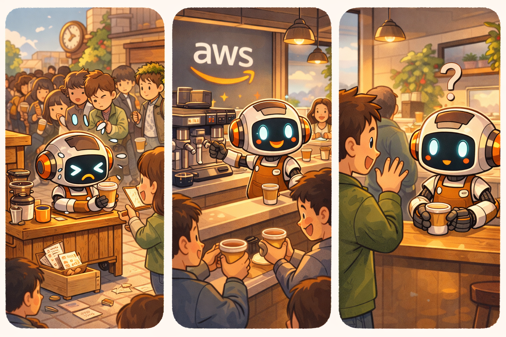

# ☁️ Level 02: Cloud Barista

## What are we building?

The same Brew from Level 01, but now running in the cloud.

## Key concepts

- **AgentCore Runtime:** A serverless hosting service for AI agents. Handles scaling, security, and session isolation.
- **BedrockAgentCoreApp:** A wrapper added to the agent so AgentCore Runtime can run it.
- **Direct Code Deploy:** Upload Python code and AgentCore builds and deploys it. No Docker needed.
- **AgentCore Starter Toolkit CLI (`agentcore`):** Command-line tool for configuration, deployment, and invocation.

## Prerequisites

- Level 01 completed

---

## Step 1: Upgrade the agent

Copy the Level 02 agent to the root (replaces the Level 01 version):

```bash
cp -f level_02_cloud_barista/agent.py agent.py
```

## Step 2: Configure and deploy

Use the interactive wizard to configure the agent. When prompted:
- Agent name: `agentcore_cafe_barista`
- Requirements file: use the detected `requirements.txt`
- Deployment type: `Direct Code Deploy`
- Python runtime: `PYTHON_3_13`
- Authorization: IAM (default)
- Memory: skip for now (type `s`)

```bash
agentcore configure -e agent.py
agentcore deploy
```

Or skip the wizard with a one-liner:
```bash
agentcore configure -e agent.py -n agentcore_cafe_barista -dt direct_code_deploy -rt PYTHON_3_13 -rf requirements.txt --disable-memory --non-interactive
agentcore deploy
```

## Step 3: Invoke Brew remotely

```bash
agentcore invoke '{"prompt": "Hola! Quiero algo con chocolate y bien fuerte"}'
agentcore invoke '{"prompt": "What cold drinks do you have?"}'
agentcore invoke '{"prompt": "Dame un latte grande con leche de almendras"}'
```

## What changed?

| | Level 01 | Level 02 |
|---|---|---|
| Where it runs | Your laptop | AgentCore Runtime (cloud) |
| How you call it | `python3.11 agent.py` | `agentcore invoke` |
| New code | — | `BedrockAgentCoreApp` wrapper + `@app.entrypoint` |

## Summary — The Adventures of Brew

<p align="center">
  
  <br><em>From a tiny cart to a full café in the AWS cloud — but who's that customer waving at Brew?</em>
</p>

## What's next

Level 03 adds memory — Brew will remember your favorite order across sessions.

➡️ [Go to Level 03](../level_03_memory_barista/INSTRUCTIONS.md)

## Troubleshooting

| Error | Fix |
|---|---|
| `agentcore: command not found` | `python3.11 -m pip install bedrock-agentcore-starter-toolkit` |
| `iam:CreateRole AccessDenied` | Use `-er <existing-role-ARN>` or use an account with IAM permissions |
| `Runtime initialization time exceeded` | Cold start — wait and retry |
