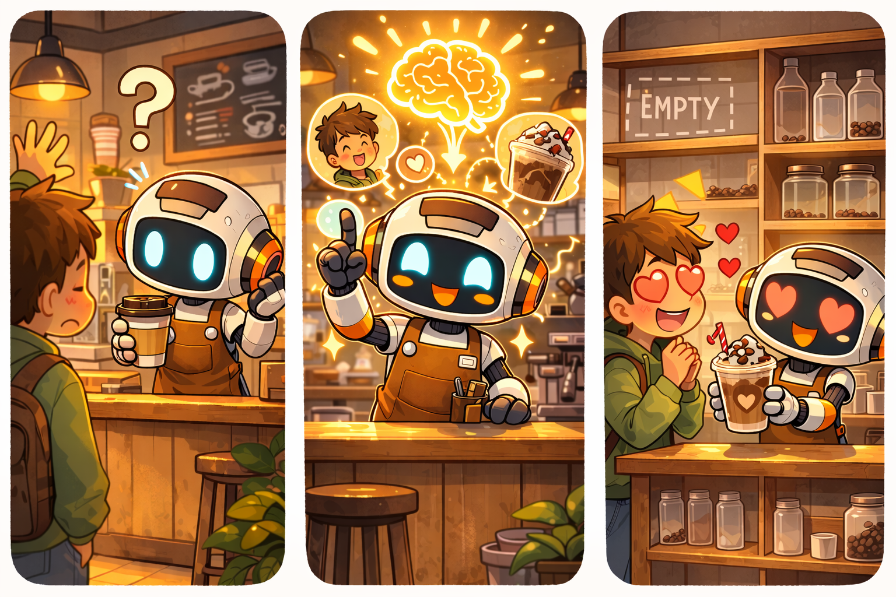

# 🧠 Level 03: Barista with Memory

## What are we building?

Brew now remembers you. If you told him last time you like oat milk mochas, he'll suggest it next time without you asking.

## Why does this matter?

Without memory, every conversation with Brew starts from zero. With memory, Brew becomes your regular barista who knows your order.

## Key concepts

- **AgentCore Memory:** A managed service that stores and retrieves conversation history and extracted facts.
- **Short-Term Memory (STM):** Stores raw conversation within a session. Managed by the toolkit automatically.
- **Long-Term Memory (LTM):** Extracts preferences and facts permanently across sessions. Requires extraction strategies.
- **Memory Strategies:** Rules that tell LTM what to extract:
  - `UserPreferenceStrategy`: "I prefer almond milk"
  - `SemanticStrategy`: "My name is Carlos", "I'm lactose intolerant"
- **AgentCoreMemorySessionManager:** The official Strands integration that handles save/retrieve/injection automatically. You pass it as `session_manager` to the Agent.
- **actor_id:** Identifies who the agent is talking to. Each actor gets their own LTM namespace, so memories don't mix between users.

## Prerequisites

- Levels 01-02 completed (agent deployed to cloud)

---

## Step 1: Test Short-Term Memory

First, reconfigure the agent without `--disable-memory` so the toolkit sets up memory permissions:

```bash
agentcore configure -e agent.py -n agentcore_cafe_barista -dt direct_code_deploy -rt PYTHON_3_13 -rf requirements.txt --non-interactive

agentcore deploy
```

Test within the same session:

```bash
SESSION="cafe-session-000000000000000000001"

agentcore invoke '{"prompt": "Siempre pido un mocha grande con leche de almendras"}' --session-id $SESSION
agentcore invoke '{"prompt": "Lo de siempre por favor"}' --session-id $SESSION
```

## Step 2: Create Long-Term Memory

```bash
python3.11 level_03_memory_barista/setup_memory.py
```

This creates a LTM resource with extraction strategies and adds memory permissions to the runtime execution role.

## Step 3: Upgrade the agent

Copy the Level 03 agent and paste the LTM ID from Step 2:

```bash
cp -f level_03_memory_barista/agent.py agent.py
```

Open `agent.py` and paste the memory ID:
```python
MEMORY_ID = "AgentCoreCafe_LTM-xxxxxxxx"  # Your ID from setup_memory.py
```

Also update `.bedrock_agentcore.yaml` so the toolkit configures memory permissions on the runtime:
```yaml
memory:
  mode: STM_AND_LTM
  memory_id: <your-LTM-ID>
  memory_arn: arn:aws:bedrock-agentcore:<region>:<account>:memory/<your-LTM-ID>
```

Redeploy:
```bash
agentcore deploy
```

## Step 4: Test Long-Term Memory

Test with two different customers to verify memories don't mix:

```bash
# Carlos tells Brew his preferences
agentcore invoke '{"prompt": "Soy intolerante a la lactosa. Me encanta el mocha con leche de almendras.", "actor_id": "carlos"}' --session-id session-carlos-000000000000000001

sleep 30

# Esteban tells Brew his preferences (in English!)
agentcore invoke '{"prompt": "I love Matcha Latte and I am vegan.", "actor_id": "esteban"}' --session-id session-esteban-00000000000000001

sleep 30

# Different sessions — Brew should remember each customer's preferences
agentcore invoke '{"prompt": "Qué me recomendás?", "actor_id": "carlos"}' --session-id session-carlos-000000000000000002
agentcore invoke '{"prompt": "What do you recommend for me?", "actor_id": "esteban"}' --session-id session-esteban-00000000000000002
```

Brew should recommend dairy-free mocha for Carlos and Matcha Latte for Esteban — across different sessions!

---

## What changed?

| | Level 02 | Level 03 |
|---|---|---|
| Memory | None | STM (toolkit) + LTM (code) |
| New code | — | `AgentCoreMemorySessionManager` (official Strands integration) |
| New file | — | `setup_memory.py` (creates LTM + adds permissions) |
| actor_id | — | Passed in payload to separate per-customer memories |

## Summary — The Adventures of Brew

<p align="center">
  
  <br><em>Brew finally remembers your name and your favorite mocha — but the shelves are running empty.</em>
</p>

## What's next

Level 04 adds a supply chain — Brew can check stock and process orders via Lambda + Gateway.

➡️ [Go to Level 04](../level_04_supply_chain/INSTRUCTIONS.md)

## Troubleshooting

| Error | Fix |
|---|---|
| `AccessDeniedException: RetrieveMemoryRecords` | Run `setup_memory.py` again — it adds permissions to the execution role |
| `Memory extraction not working` | LTM extraction takes ~30 seconds. Wait and retry with a new session ID |
| `Agent doesn't remember across sessions` | Check `MEMORY_ID` is set in `agent.py` and you redeployed |
| `Memories mixing between customers` | Make sure you pass different `actor_id` in the payload for each customer |
