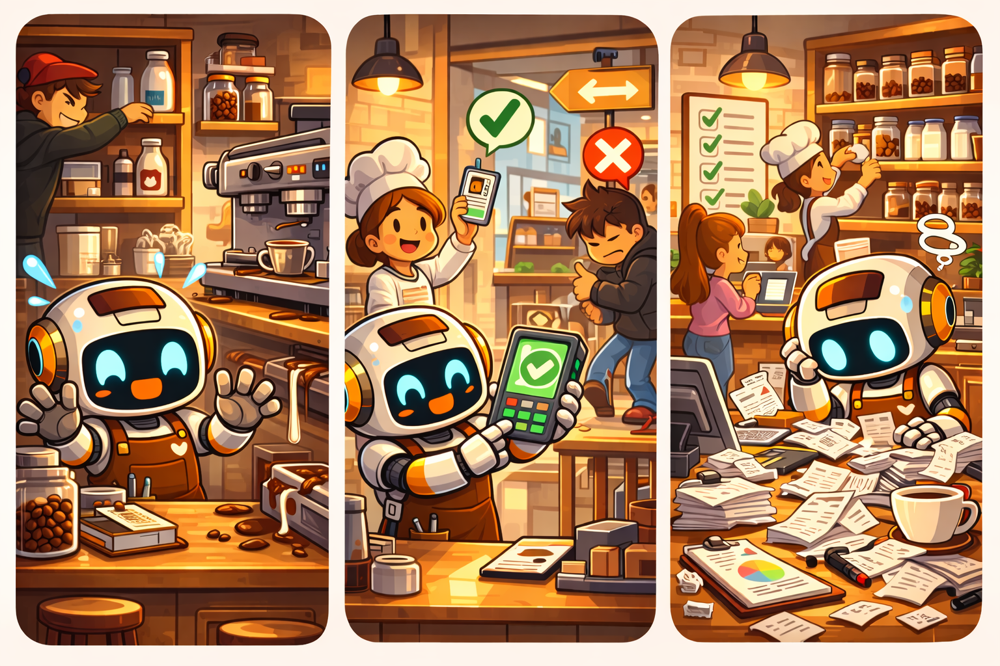

# 🔐 Level 05: Staff vs Customers

## What are we building?

Brew now uses AgentCore Identity for real authentication. Users must authenticate with Cognito to invoke the agent. The user's identity (staff or customer) flows through to the Gateway, so Cedar policies in Level 08 can enforce role-based access.

## Key concepts

- **AgentCore Identity (Inbound Auth):** Validates who can invoke the agent. The Runtime checks the JWT token before running your code.
- **Amazon Cognito:** A managed identity service. Users have usernames, passwords, and belong to groups (staff/customers).
- **JWT Bearer Token:** When you authenticate with Cognito, you get a token with claims like `username` and `cognito:groups`. Pass it with `--bearer-token` when invoking.
- **Token propagation:** The agent reads the token from the request header and passes it to the Gateway. This way, the Gateway (and Cedar policies) know who the user is.

## Prerequisites

- Levels 01-04 completed (agent deployed with Gateway)

---

## Step 1: Create identity infrastructure

```bash
python3.11 level_05_identity/setup_identity.py
```

What it does:
1. Creates a Cognito User Pool (`AgentCoreCafe-Users`) with two groups: `staff` and `customers`
2. Creates two test users: `barista_ana` (staff, password: `Brew2026!`) and `customer_carlos` (customers, password: `Coffee2026!`)
3. Creates an App Client for user authentication (USER_PASSWORD_AUTH)
4. Updates the Gateway authorizer to accept JWT tokens from this Cognito (so the user's identity flows to Cedar policies later)
5. Adds Cognito and DynamoDB permissions to the Runtime execution role
6. Saves Pool ID, Client ID, and Discovery URL to SSM Parameter Store

## Step 2: Upgrade the agent

```bash
cp -f level_05_identity/agent.py agent.py

# Read Cognito config from SSM
POOL_ID=$(aws ssm get-parameter --name /agentcore-cafe/cognito_pool_id --query Parameter.Value --output text)
CLIENT_ID=$(aws ssm get-parameter --name /agentcore-cafe/cognito_client_id --query Parameter.Value --output text)
DISCOVERY_URL=$(aws ssm get-parameter --name /agentcore-cafe/cognito_discovery_url --query Parameter.Value --output text)

# Configure with JWT auth + header allowlist
agentcore configure -e agent.py -n agentcore_cafe_barista -dt direct_code_deploy -rt PYTHON_3_11 -rf requirements.txt --disable-memory \
  --authorizer-config "{\"customJWTAuthorizer\":{\"discoveryUrl\":\"${DISCOVERY_URL}\",\"allowedClients\":[\"${CLIENT_ID}\"]}}" \
  --request-header-allowlist "Authorization" --non-interactive

agentcore deploy
```

## Step 3: Test

Since the variables `POOL_ID` and `CLIENT_ID` were set in Step 2, get tokens:

```bash
CARLOS_TOKEN=$(agentcore identity get-cognito-inbound-token \
  --pool-id $POOL_ID --client-id $CLIENT_ID \
  --username customer_carlos --password 'Coffee2026!')

ANA_TOKEN=$(agentcore identity get-cognito-inbound-token \
  --pool-id $POOL_ID --client-id $CLIENT_ID \
  --username barista_ana --password 'Brew2026!')
```

Test:
```bash
# Carlos orders (customer — should work)
agentcore invoke '{"prompt": "Dame un latte grande con leche de avena"}' --bearer-token "$CARLOS_TOKEN"

# Carlos tries to restock (customer — denied)
agentcore invoke '{"prompt": "Restock coffee beans with 50 units"}' --bearer-token "$CARLOS_TOKEN"

# Ana checks stock (staff — should work)
agentcore invoke '{"prompt": "Cómo está el inventario?"}' --bearer-token "$ANA_TOKEN"

# Ana restocks (staff — should work)
agentcore invoke '{"prompt": "Restock oat milk with 20 units"}' --bearer-token "$ANA_TOKEN"

# Who am I?
agentcore invoke '{"prompt": "Quién soy?"}' --bearer-token "$ANA_TOKEN"
```

---

---

## What changed?

| | Level 04 | Level 05 |
|---|---|---|
| Authentication | None (anyone can invoke) | JWT bearer token required |
| Identity | No user context | User identity from Cognito JWT |
| Access control | None | Role-based (staff vs customers) |
| Gateway auth | Client credentials (M2M) | User token (identity flows to Gateway) |
| New tools | — | `whoami`, `restock` |
| New infra | — | Cognito User Pool + groups, Gateway authorizer updated |

## Summary — The Adventures of Brew

<p align="center">
  
  <br><em>Staff badge in, customers stay out of the kitchen — but who's going to make sense of all these receipts?</em>
</p>

## What's next

Level 06 adds Code Interpreter — Brew can generate sales charts and stock projections.

➡️ [Go to Level 06](../level_06_daily_report/INSTRUCTIONS.md)

## Troubleshooting

| Error | Fix |
|---|---|
| `AccessDeniedException` on invoke | You need `--bearer-token`. Get one with `agentcore identity get-cognito-inbound-token` |
| `Token expired` | Cognito tokens expire after 1 hour. Get a new one. |
| `Only staff can restock` | You're invoking as customer_carlos. Use barista_ana's token. |
| `POOL_ID` or `CLIENT_ID` empty | Re-run the SSM get-parameter commands from Step 2 |
